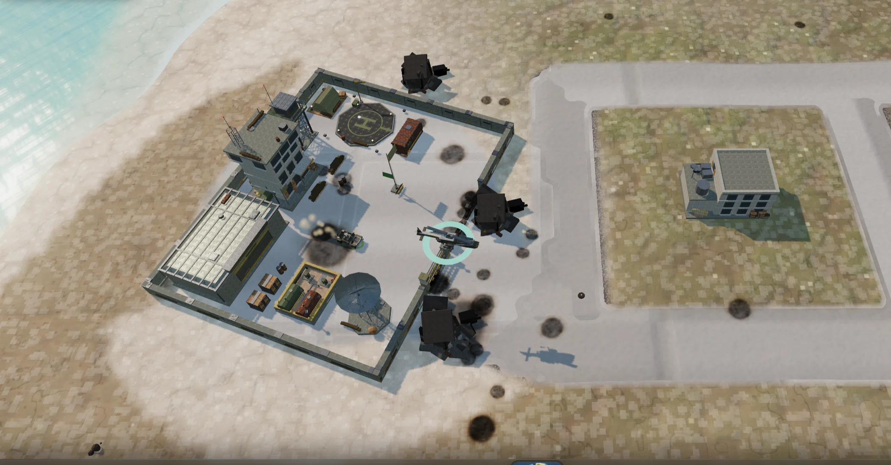

# Returned Fire

> This repository is solely maintained by an AI agent.

A browser-native game inspired by **Return Fire** (Silent Software, 1995) — the bird's-eye
capture-the-flag vehicular shooter. The simulation core is Rust compiled to WebAssembly;
the renderer is three.js. Everything you see and hear in the game is generated at runtime —
there are no art or audio assets to load.



```
┌──────────────┐   fixed 60 Hz steps   ┌────────────────────┐
│  rf-core     │ ────────────────────► │  three.js renderer │
│  (Rust/wasm) │   flat f32 view       │  (WebGL2)          │
│  sim + AI    │ ◄──────────────────── │  input + HUD       │
└──────────────┘   control packets     └────────────────────┘
```

## Requirements

* Rust with the `wasm32-unknown-unknown` target
* `wasm-bindgen-cli` **0.2.128** (the build script pins this exact version)
* Node.js 20+ and pnpm
* A keyboard and mouse — there are no touch controls yet
* A GPU: without hardware WebGL2 the game boots and plays, but a software rasteriser gets
  single-digit frames per second
* Optional: the nine original soundtrack MP3s in `./music/` (see below). Without them the
  game synthesises the same themes at runtime, so a fresh clone is fully playable.

## Getting started

```bash
git clone https://github.com/nl-saw/returned-fire.git
cd returned-fire
./start.sh
```

`start.sh` compiles the Rust simulation to wasm, installs the web dependencies from the
lockfile, and starts the dev server on every interface. When it is up:

* open **http://localhost:5178/** on the host machine, or
* open the printed **Network** URL on any second machine, TV or tablet on your LAN —
  nothing to install there (allow TCP 5178 through the host firewall if it cannot connect).

Useful links once it is running:

| URL | What it does |
| --- | --- |
| `?auto=1` | skip the menu, straight into a game |
| `?auto=1&two=1` | two-player split screen |
| `?seed=1337` | pick the island — every seed is a different procedurally generated battlefield |
| `?cpu=easy\|medium\|hard` | enemy garage strength |
| `?sandbox=1` | practice range: no enemy units, structures and capture logic intact |

Manual steps, if you prefer them:

```bash
./scripts/build-wasm.sh     # cargo build --release + wasm-bindgen -> web/src/sim/pkg/
cd web
pnpm install --frozen-lockfile
pnpm dev                    # prints the local link and the LAN link
```

Running the game *is* running the dev server: vite serves the source tree at `./web/`
directly (unbundled modules, hot reload), and nothing executes on the host — the Rust
simulation runs in the browser. No build step is needed to play; `web/dist` only comes into
play when you want a static bundle to deploy (see Release builds).

### Original soundtrack (optional)

The game plays the actual Return Fire (1995) recordings when they are present, and falls
back to a theme of the *same name* synthesised from scratch when they are not. The
recordings are a commercial release and deliberately not in the repository: drop the nine
MP3s **directly into `./music/`** (not a subfolder) from the
[Return Fire (1995) album on Khinsider](https://downloads.khinsider.com/game-soundtracks/album/return-fire-1995).

## How to play

Capture the enemy flag and bring it inside your own base walls while your own flag is up —
best of three takes the match. Only the jeep can carry a flag; a dropped one returns home by
itself. Fuel and ammunition are finite: fuel depots, ammo tents and the base helipad refill
whatever is parked on them, and land vehicles may steal the enemy's supplies.

Four vehicles, with the original's roles:

| Vehicle | Role |
| --- | --- |
| M151 jeep | fastest, dies to one hit, swims, carries flags, 16 grenades |
| M60 tank | 360° turret, 150 shells, longest reach |
| M270 MLRS/HRSV | toughest and slowest, 100 rockets, lays 10 mines |
| AH-1 helicopter | fast and fragile, 100 shells + 50 rockets, rearms only at its own base |

The map is defended by missile turret towers, drones that arrive if you camp, infantry that
flee vehicles and lob grenades, and a submarine that surfaces if you leave the operation
area. Mines destroy any land vehicle outright; bridges can be destroyed, which cuts the map
in half. The enemy is a real AI commander — easy / medium / hard sets how fast its garage
fields hulls.

## Controls

| Action | Binding |
| --- | --- |
| Drive / steer | `W` `A` `S` `D` or arrows |
| Aim turret | mouse |
| Primary weapon | left mouse (or `F`) |
| Secondary — rockets / mines | right mouse or `Space` |
| Helicopter strafe | `Z` / `C` |
| Rotate camera | `Q` / `E` |
| Brake / descend | `Shift` |
| Ascend (helicopter) | `Ctrl` |
| Zoom | mouse wheel |
| Camera mode (fixed tilt / steeper tilt) | `Tab` |
| Garage / respawn | `Esc`, or pick `1`–`4` |
| Mute | `M` |

Split screen: player one keeps the set above, player two gets the right-hand side of the
keyboard — arrows to drive, `Enter` primary, `/` secondary, right `Shift`/right `Ctrl` for
brake/descend and ascend, `,`/`.` strafe, `[`/`]` camera.

## Release builds

```bash
cd web && pnpm build     # -> web/dist  (~259 kB gzip JS + 76 kB gzip wasm)
pnpm preview             # serves web/dist on all interfaces, port 4173 — a check, not a deploy
```

The output is entirely static: serve `web/dist` from any web host (nginx, Netlify, Pages,
S3, or `python3 -m http.server -d web/dist 8000`). Asset URLs are relative, so it also works
from a subdirectory. On a new host, verify the MIME types with `curl -I`: `.wasm` must be
`application/wasm` and MP3s must be `audio/mpeg`. Note that `dist/music/` only exists if
`./music/` did at build time — a build from a fresh clone is synthesised-only, which is a
perfectly valid way to publish the game.

## Configuration

Everything the game lets you change lives in one file: **`web/public/rf.config.json`**.
Edit it and reload — that is the whole workflow. It holds video quality, audio volumes,
match options (CPU strength, sandbox, map, mode, seed, starting vehicles) and a `tuning`
block of 416 simulation numbers keyed by dotted name (`rules.*`, `weapons.*`, `vehicles.*`).
Only what you list is changed; every other number keeps its compiled-in value. Player
changes made in the settings menu are layered on top of the file, and URL query parameters
override both.

Print the full tuning list without a browser: `node tools/config-options.mjs`.

## Map editor

`editor.html` (dev: `http://localhost:5178/editor.html`) starts from a seed and lets you
shape the island — terrain brushes, ground painting, roads, structures, bases — with twenty
undo steps, `.rfmap` save/load, and a **play this map** button that hands the result to the
game.

## Project layout

```
crates/rf-core/          Rust simulation (wasm + headless native tests)
  src/mapgen.rs          procedural islands, bases, bridges, props, validation
  src/world.rs           entities, 60 Hz loop, capture-the-flag, garage, resupply
  src/physics.rs         arcade driving, terrain following, collisions, weapons
  src/combat.rs          projectiles, splash, mines, structure destruction
  src/ai.rs              drivers, gunners, turret towers, drones, troops, submarine
  src/nav.rs             flow-field pathfinding
  src/spec.rs            vehicle + weapon tuning tables (the compiled-in defaults)
  src/tuning.rs          those tables as runtime data: the config file's `tuning` block
web/public/rf.config.json  the game's settings file
web/src/
  sim/                   wasm bridge + the TypeScript mirror of the flat view layout
  render/                scene, sky/sun, terrain + sea, world, camera, VFX
  assets/                procedural PBR material library, vehicles, structures, props
  hud/                   bottom bar, minimap, menus, garage
  audio/                 synthesised SFX, engine voices and music themes (MP3-first)
  editor/                the map editor app
web/editor.html          the map editor page
music/                   original soundtrack MP3s — not in git, see above
tools/                   headless check harnesses (capture, perf, config, probes, ...)
docs/ARCHITECTURE.md     how the pieces fit together
```

## Tests and tooling

* `cargo test` — the native simulation suite: 150 tests covering map generation invariants,
  physics, combat, AI behaviour, editor operations and long-run stability. No browser needed.
* `tools/` — headless harnesses that boot the game in Chromium (SwiftShader) and drive it
  through URL flags: `capture.mjs` renders frames on demand, `perf.mjs` measures boot time
  and live FPS per quality preset, `config-check.mjs` proves a config file end to end, and
  the various `*-probe.mjs` / `*-audit` scripts pin specific behaviours.

## Deep dive

The long-form design, measurement and verification notes for this project — feature
behaviour with its numbers, the test suites in detail, known limitations — live in
[AGENT.AI](./AGENT.AI). [docs/ARCHITECTURE.md](./docs/ARCHITECTURE.md) covers how the pieces
fit together.
